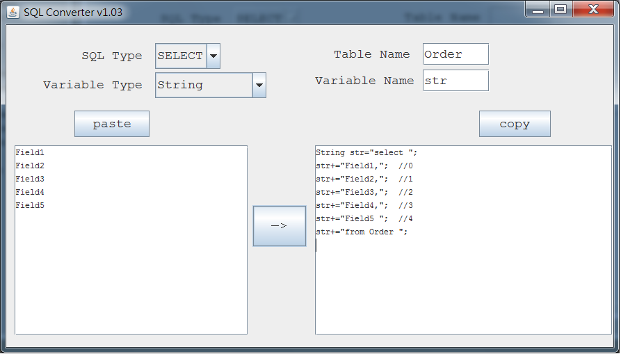

# About

SQL Converter will help user turn a text into a sql statement which is with variable.

There are 4 SQL statements and 2 Variable types can be chosen on SQL Converter. 

Once the user generate the result by SQL Converter. 

It will be more convenient for making query sentence.

Development Environment :
Windows7
NetBean  7.4
JDK Java 1.7 

# Referrence

# Update 
### v1.01 Beta

### v1.02 Beta
add index annotation  
add variable name field validation

### v1.03
cancel inner label title in JFrame  
push to Github

